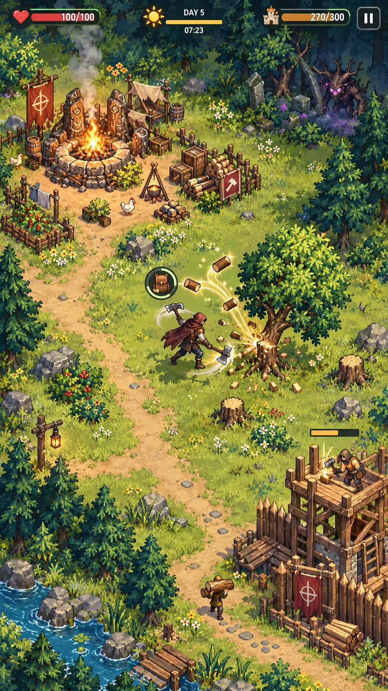
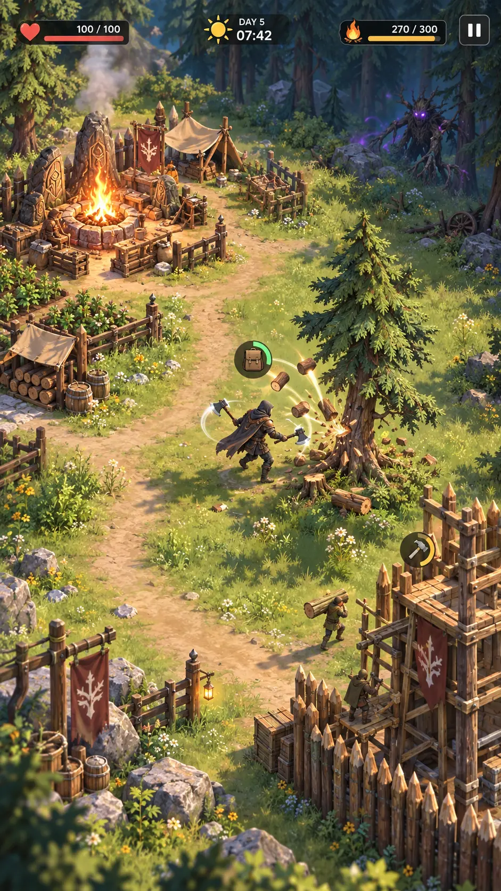
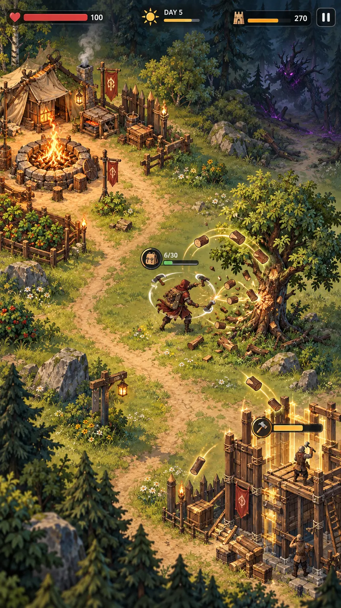
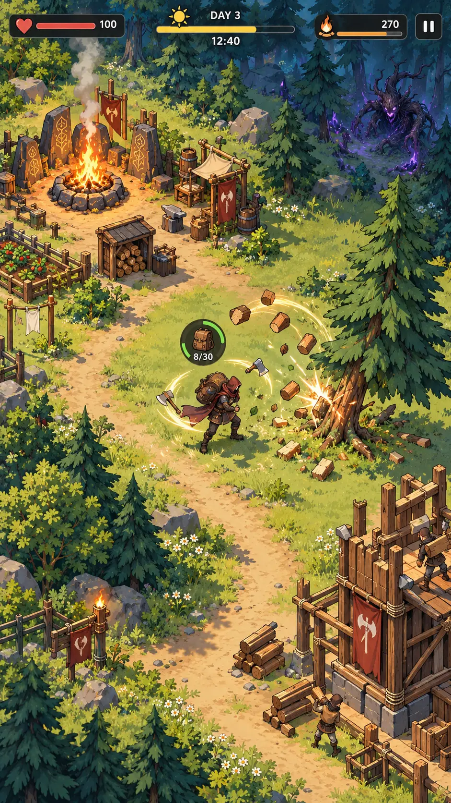
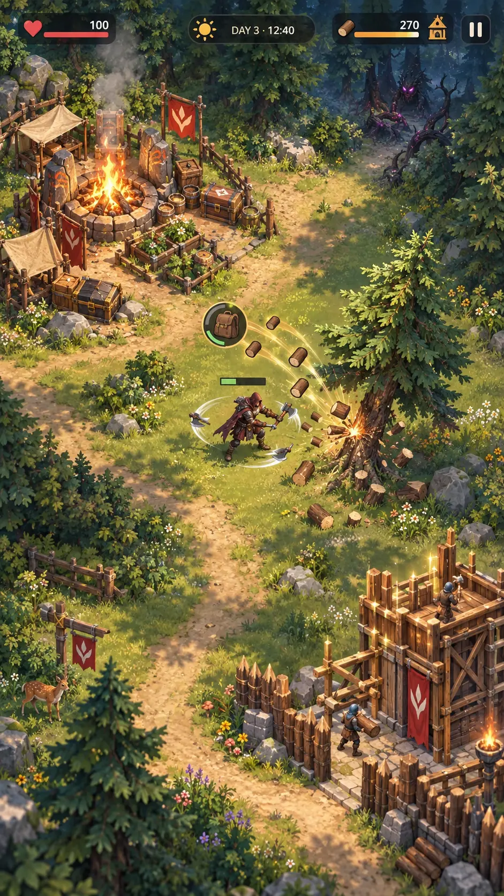

# AXEHOLD — Mass-Market Reconnect

## Зачем создан второй набор

Первая серия A–E исследовала пять способов подачи мрачного folk-fantasy. Она показала возможный визуальный уровень, но слишком далеко сместила эмоциональный центр игры в сторону тёмного боевого roguelike.

Второй набор F–J возвращает исходное рекламное обещание AXEHOLD:

- герой активно двигается;
- два топора вращаются вокруг него;
- дерево реагирует на удар;
- древесина летит в рюкзак;
- Очаг является уютной базой;
- доставленные ресурсы превращаются в видимое укрепление;
- далёкая угроза создаёт контраст, но не делает весь день мрачным;
- игровой цикл понятен по одному кадру без поясняющего текста.

Общая эмоция: **приятное приключение и рост днём — давление и проверка ночью**.

## F — Bright Modern HD Pixel

Ближайшее развитие исходной рекламной идеи: яркая понятная поляна, приятная добыча, физический лагерь, заметное строительство и современный HD pixel-art.

**Плюсы:** мгновенная понятность, массовая привлекательность, хороший production pipeline, естественная связь с первоначальной концепцией.  
**Риски:** избыток цветов и мелких деталей может приблизить игру к уютному фермерскому симулятору; ночью потребуется сохранить характер AXEHOLD.

## G — Stylized Mobile 3D Adventure

Доступное стилизованное 3D: солнечная поляна, живые модели, тёплый лагерь и холодная глубина леса.

**Плюсы:** полноценные скелетные анимации, динамический свет, повороты персонажей, хорошая масштабируемость контента.  
**Риски:** нужен новый 3D-pipeline; без сильного art direction стиль может стать похожим на другие мобильные игры.

## H — Warm Storybook Fantasy 2D

Рисованная взрослая сказка без grimdark: тёплая база, мягкая природа, выразительные ресурсы и заметная граница заражённого леса.

**Плюсы:** эмоциональность, авторский характер, богатая атмосфера, хорошая история мира.  
**Риски:** сложнее и дороже анимировать; потребуется упростить формы для реального игрового масштаба.

## I — Clean Cel-Shaded Action Adventure

Чистая динамичная графика с сильными силуэтами, крупными цветовыми пятнами и выразительными эффектами удара.

**Плюсы:** лучшая читаемость действия, сильный герой, понятные топоры и ресурсы, хороший баланс массовости и собственного характера.  
**Риски:** важно не уйти в слишком мультяшную или детскую подачу; UI и эффекты должны оставаться сдержанными.

## J — Cozy Premium 2.5D Diorama

Премиальная миниатюрная сцена с тёплым солнечным светом, глубиной, живой поляной и красивым ростом укрепления.

**Плюсы:** высокий визуальный уровень, приятный мир, сильный контраст лагеря и далёкой порчи, отличная демонстрация строительства.  
**Риски:** сложнее сохранить идеальную читаемость в массовом бою; производство окружения и параллакса дороже.

## Сравнение

| Направление | Близость к рекламе | Массовая привлекательность | Читаемость действия | Потенциал движения | Уникальность | Реалистичность производства |
|---|---:|---:|---:|---:|---:|---:|
| F — Bright HD Pixel | 10 | 9 | 9 | 8.5 | 8 | 9 |
| G — Mobile 3D | 8.5 | 9 | 9 | 10 | 7.5 | 7.5 |
| H — Storybook 2D | 8 | 8.5 | 8 | 7 | 9 | 6.5 |
| I — Cel-Shaded | 9 | 9.5 | 9.5 | 9 | 9 | 8 |
| J — Cozy 2.5D | 8.5 | 9.5 | 8.5 | 8 | 8.5 | 6.5 |

## Рабочий вывод

- **F** лучше всего сохраняет DNA исходной рекламы.
- **I** даёт наиболее сильный баланс массовости, динамики и собственной визуальной идентичности.
- **G** лучше всего решает проблему настоящих движений и долгосрочной анимации.
- **J** производит наиболее премиальное и уютное первое впечатление.
- **H** подходит, если приоритетом станет авторская рисованная атмосфера.

Первую серию не нужно выбрасывать полностью. Из неё можно взять:

- более серьёзный дизайн врагов;
- холодный опасный внешний лес;
- выразительные телеграфы;
- редкие мрачные события;
- драматичную ночь и боссов.

Но основной дневной gameplay должен оставаться приятным, понятным и визуально вознаграждающим. Это и есть правильное объединение исходной рекламы с более глубокой игрой.
