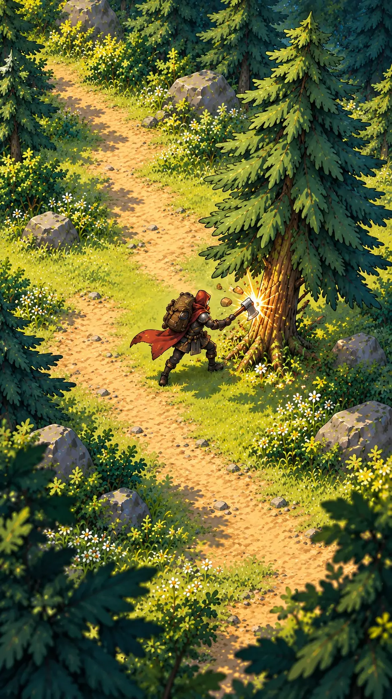

# AXEHOLD — Harvest Proof V2

This frame replaces the rejected V1.23 visual slice as the production target for the next implementation gate.

## The gate is deliberately small

The build must prove only three things before any wider visual migration:

1. the Wanderer reads clearly and moves convincingly at phone scale;
2. the forest is assembled as a coherent layered play space;
3. striking one tree has satisfying anticipation, contact, recoil, chips, shadow response, and resource pickup.

## Runtime requirements

- hero height: roughly 14–16% of the visible play area;
- camera: stable 3/4 top-down view with a closer gameplay crop;
- environment: separate ground, path, vegetation, rocks, canopy, and foreground layers;
- character: one locked design and proportions across every frame;
- movement: authored directional walk cycle, not whole-sprite bobbing;
- harvest: anticipation → contact → hit-stop → recoil → wood chips → pickup arc;
- no HUD during the first animation review;
- no enemies, timer, Hearth, tower, or meta systems until the gate passes.

## Rejection criteria

- visible collage edges or floating cutouts;
- character morphing between frames;
- mismatched perspective or scale;
- empty matte-painting field;
- placeholder geometry;
- UI used to explain an unreadable interaction.
