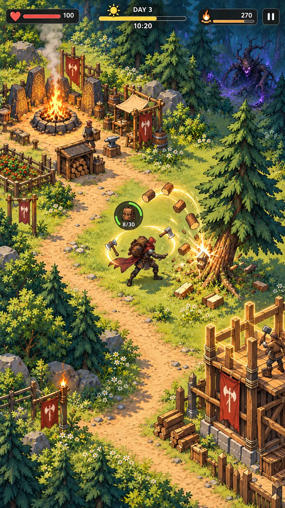
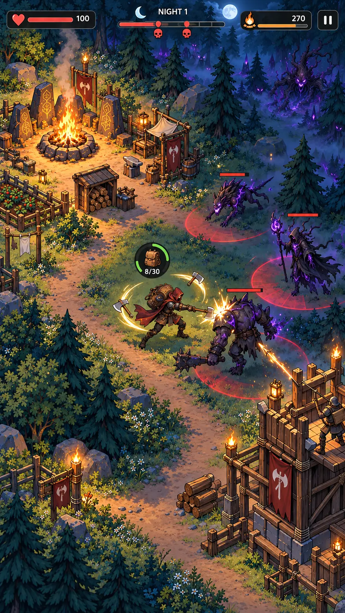

# AXEHOLD — Art Direction Lock

## Выбранное направление

**Concept I — Clean Cel-Shaded Action Adventure.**

Направление выбрано как лучший баланс:

- массовой привлекательности;
- связи с исходной рекламной концепцией;
- мобильной читаемости;
- визуальной индивидуальности;
- возможности создавать полноценные движения;
- разумной производственной сложности.

## Эталонные кадры

### День

### Ночь

## Эмоциональная формула

> **Приятное приключение и рост днём — давление и проверка ночью.**

День не должен выглядеть grimdark. Ночь не должна превращаться в нечитаемое чёрное полотно. Очаг остаётся тёплым визуальным домом в любое время.

## Неприкосновенные признаки стиля

- фиксированная камера сверху под углом 3/4;
- чистые крупные силуэты;
- контролируемый контур;
- зрелые, не chibi-пропорции;
- упрощённые, но качественные фактуры;
- одинаковая детализация героя, врагов, мира и построек;
- светлый зелёно-золотой день;
- синяя/бирюзовая ночь с янтарным центром;
- графичные локальные эффекты удара;
- компактный тёмный HUD с крупными пиктограммами;
- минимум текста во время gameplay.

## Дневной gameplay

Главный продающий образ:

1. Странник движется.
2. Два топора вращаются вокруг него.
3. Один топор физически контактирует с ресурсом.
4. Дерево или камень реагирует на удар.
5. Добыча летит по дуге к герою.
6. Рюкзак заметно заполняется.
7. На заднем плане виден тёплый Очаг.
8. Доставленные ресурсы превращаются в реальную постройку.
9. Далёкая опасность существует, но не доминирует над кадром.

## Ночной gameplay

- география поляны остаётся узнаваемой;
- тёплая зона Очагa образует безопасный остров;
- внешний лес становится холоднее, глубже и опаснее;
- враги различаются силуэтом и движением;
- атаки имеют чистые красные телеграфы;
- башня, палисад и герой одновременно участвуют в обороне;
- эффекты не закрывают персонажей;
- ночь напряжённая и красочная, а не беспросветная.

## Герой

- красно-коричневый капюшон и плащ;
- тёмная практичная броня;
- крупный видимый рюкзак;
- две одноручные секиры;
- сильная линия действия в позах;
- ноги, руки, корпус, плащ и оружие анимируются отдельно;
- силуэт читается при уменьшении до реального размера телефона.

## Мир

- лагерь выглядит обитаемым, но не превращается в ферму;
- поляна даёт пространство для движения;
- декор группируется по краям маршрутов;
- фоновые деревья формируют лесную массу;
- добываемые ресурсы выделяются формой и реакцией, а не неестественной обводкой;
- заражение концентрируется дальше от Очагa и усиливается ночью.

## Запреты

- одиночные детализированные PNG поверх пустой земли;
- реалистичные персонажи рядом с примитивной геометрией;
- статичная ходьба через покачивание целого изображения;
- постоянная grimdark-палитра;
- детская chibi-стилизация;
- чрезмерно уютный фермерский образ без угрозы;
- случайные UI-подписи над объектами;
- тяжёлые панели, закрывающие мир;
- разные углы камеры и масштабы ассетов;
- переход к массовому производству до animation proof of concept.

## Следующий production gate

До переделки всей игры должен быть создан короткий вертикальный срез:

- 20–30 секунд дневного движения и добычи;
- переход день → ночь;
- 20–30 секунд обороны;
- настоящий walk cycle;
- вращение и контакт двух топоров;
- реакция дерева и летящая добыча;
- два типа врагов;
- Очаг, Башня и палисад;
- работа света, теней и VFX;
- проверка на реальном телефоне.

Только после одобрения ощущения движения и читаемости стиль переносится на полный Забытый лес.
