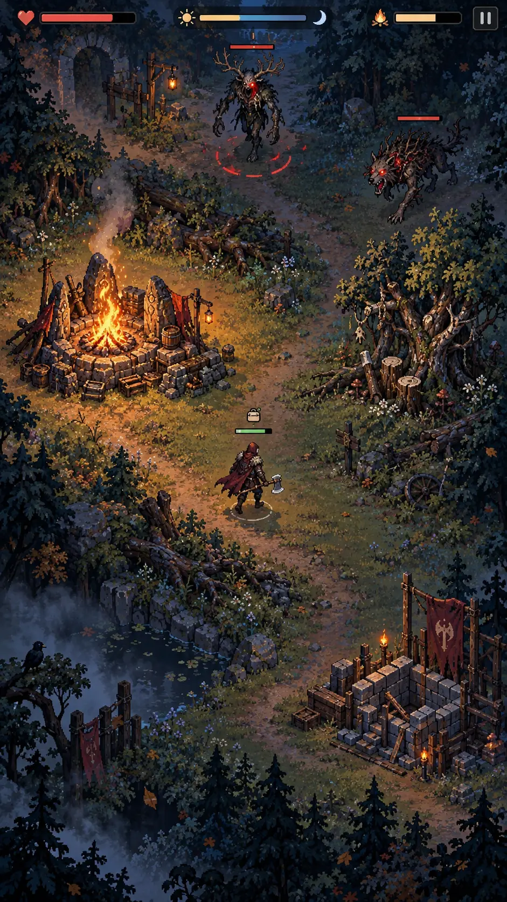
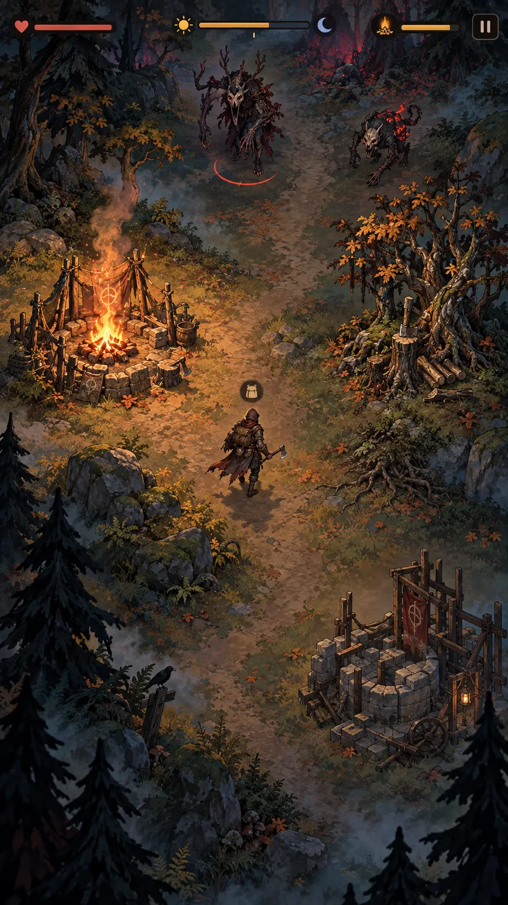
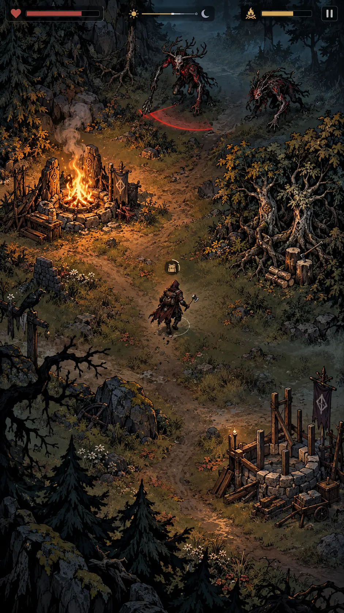
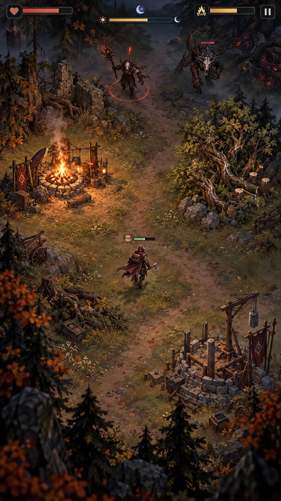
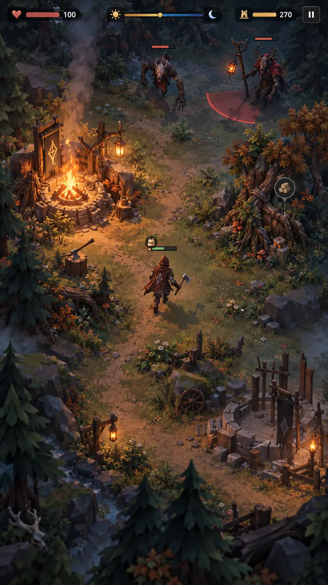

# AXEHOLD Visual Rebuild v2 — пять концептов

Все пять изображений созданы как сопоставимые gameplay mockup одной сцены: Странник движется по лесной поляне рядом с Последним Очагом, два разных врага входят сверху, справа расположен добываемый древесный ресурс, в нижней части строится Башня, а день переходит в ночь.

## Общие требования

- portrait 9:16;
- фиксированная камера сверху под углом 3/4;
- герой немного ниже центра;
- Очаг слева от центра;
- два противника в верхней части;
- естественная тропа и плотная кромка леса;
- единые перспектива, масштаб, контактные тени и свет;
- компактный HUD: герой, время, Очаг, рюкзак, пауза;
- минимум 75% экрана остаётся игровым миром;
- кадр показывает реальный gameplay, а не рекламный key art;
- поза героя, плащ, огонь, туман, листва и телеграф врага демонстрируют готовность к анимации.

## A — Modern HD Pixel

Современный детализированный пиксельный survival. Сильные стороны — понятная структура карты, хороший контраст и относительно предсказуемое производство sprite sheets. Риск — при чрезмерной детализации пиксельность может потеряться на телефоне и потребует строгой палитры и масштаба пикселя.

## B — Stylized Hand-Painted

Цельный рисованный мир с мягкими материалами и выразительным светом. Сильные стороны — атмосфера, авторский характер и эмоциональность. Риск — дорогая покадровая анимация; для production потребуется упростить некоторые фактуры и разделить персонажей на анимационные слои.

## C — Dark Graphic Fantasy

Графичный мир с сильными силуэтами, контуром и крупными цветовыми пятнами. Сильные стороны — лучшая 2D-читаемость, узнаваемость и понятные телеграфы атак. Риск — необходимо внимательно дозировать чёрные массы, чтобы ночь не превращалась в тёмное пятно.

## D — Stylized 2.5D Diorama

Самый кинематографичный и пространственный 2D-вариант. Сильные стороны — глубина, свет, многоплановая композиция и премиальное впечатление. Риск — наиболее трудоёмкое сочетание 2D-ассетов, параллакса, теней и согласованных анимаций.

## E — Stylized Low-Poly 3D

Полноценная стилизованная 3D-сцена с нарисованными материалами. Сильные стороны — настоящие скелетные движения, динамический свет, тени, повороты персонажей, реакция растительности и быстрое создание новых анимаций после готового рига. Риск — потребуется новый 3D-pipeline и отдельная оптимизация средних Android-устройств.

## Предварительное сравнение

Оценки являются рабочей арт-директорской оценкой до технических прототипов.

| Направление | Впечатление | Читаемость | Потенциал движения | Производственная реалистичность | Главная особенность |
|---|---:|---:|---:|---:|---|
| A — HD Pixel | 8.5 | 8.5 | 8.5 | 8.5 | надёжный путь для 2D survival |
| B — Hand-Painted | 9.0 | 8.0 | 7.0 | 6.5 | самая тёплая авторская живопись |
| C — Graphic Fantasy | 9.0 | 9.5 | 8.0 | 8.0 | лучший баланс уникальности и 2D-читаемости |
| D — 2.5D Diorama | 9.5 | 8.5 | 7.5 | 6.0 | максимальная атмосфера и глубина |
| E — Low-Poly 3D | 9.0 | 9.0 | 9.5 | 7.5 | лучший фундамент для полноценных движений |

## Предварительный вывод

- Если главный приоритет — **качественные движения и долгосрочное расширение**, сильнее всего вариант E.
- Если важно сохранить **2D и получить узнаваемый конкурентный образ**, сильнее всего вариант C.
- Если нужен **самый безопасный и производственно понятный путь**, вариант A.
- Варианты B и D визуально очень сильные, но потребуют более дорогого производства анимаций и окружения.

После выбора одного направления создаются уточнённые дневной и ночной кадры, затем короткий animation proof of concept. Только после его проверки начинается переделка игры.
